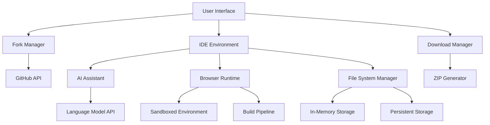

# Design Document: Integrated Fork Development

## Overview

The Integrated Fork Development feature provides a comprehensive solution for automatically forking GitHub repositories and enabling in-browser development with AI assistance. The system consists of five main components: Fork Management, IDE Environment, AI Assistant Integration, Browser Runtime, and Download Manager.

## Architecture

### High-Level Architecture



### Component Architecture

1. **Fork Manager**: Handles GitHub repository forking operations
2. **IDE Environment**: Provides code editing interface with file management
3. **AI Assistant**: Integrates with language models for code assistance
4. **Browser Runtime**: Executes code in sandboxed environment
5. **Download Manager**: Packages and downloads modified repositories

## UI Integration Points

### Repository Card Integration
**Location**: `src/components/MyRepositories.tsx`
- Add "Fork & Code" button to each repository card
- Show fork status indicator for already forked repos
- Add "Open in IDE" button for user's forked repositories

### Repository Details Dialog Integration  
**Location**: `src/components/RepositoryDetailsDialog.tsx`
- Add primary "Fork & Code with AI" action button
- Show fork management options in sidebar
- Add "Launch IDE" button for existing forks

### New IDE Interface
**Location**: `src/components/IDE/` (new directory)
- Full-screen IDE layout with resizable panels
- File tree, code editor, AI assistant, and terminal
- Integrated build/run controls and download options

### Navigation Integration
**Location**: Main app routing
- Add `/ide/:forkId` route for IDE interface
- Add fork management to user dashboard
- Integrate with existing authentication flow

## Components and Interfaces

### 1. Fork Manager

**Purpose**: Manages automatic repository forking operations

**Key Interfaces**:
```typescript
interface ForkManager {
  forkRepository(owner: string, repo: string): Promise<ForkResult>;
  getForkStatus(forkId: string): Promise<ForkStatus>;
  listUserForks(): Promise<Fork[]>;
  deleteFork(forkId: string): Promise<void>;
}

interface ForkResult {
  success: boolean;
  forkUrl: string;
  forkId: string;
  error?: string;
}

interface Fork {
  id: string;
  originalRepo: string;
  forkUrl: string;
  createdAt: Date;
  lastModified: Date;
  status: 'active' | 'archived';
}
```

**Implementation Details**:
- Extends existing GitHub API service
- Uses Octokit for fork operations
- Implements retry logic for failed operations
- Stores fork metadata in local storage

### 2. IDE Environment

**Purpose**: Provides in-browser code editing with file management

**Key Interfaces**:
```typescript
interface IDEEnvironment {
  loadRepository(forkId: string): Promise<void>;
  getFileTree(): FileNode[];
  openFile(path: string): Promise<FileContent>;
  saveFile(path: string, content: string): Promise<void>;
  createFile(path: string, content: string): Promise<void>;
  deleteFile(path: string): Promise<void>;
  searchFiles(query: string): Promise<SearchResult[]>;
}

interface FileNode {
  name: string;
  path: string;
  type: 'file' | 'directory';
  children?: FileNode[];
  size?: number;
  lastModified?: Date;
}

interface FileContent {
  path: string;
  content: string;
  language: string;
  encoding: string;
}
```

**Implementation Details**:
- Uses Monaco Editor for code editing
- Implements virtual file system in browser memory
- Supports syntax highlighting for 50+ languages
- Provides file tree navigation with drag-and-drop
- Includes search and replace functionality

### 3. AI Assistant Integration

**Purpose**: Provides intelligent code assistance and generation

**Key Interfaces**:
```typescript
interface AIAssistant {
  getCodeSuggestions(context: CodeContext): Promise<Suggestion[]>;
  generateCode(prompt: string, context: CodeContext): Promise<CodeGeneration>;
  explainCode(code: string, language: string): Promise<Explanation>;
  refactorCode(code: string, instructions: string): Promise<RefactoredCode>;
}

interface CodeContext {
  currentFile: string;
  cursorPosition: Position;
  selectedText?: string;
  projectFiles: string[];
  language: string;
}

interface Suggestion {
  text: string;
  insertText: string;
  kind: 'method' | 'property' | 'variable' | 'function';
  documentation?: string;
}
```

**Implementation Details**:
- Integrates with OpenAI GPT-4 or similar LLM
- Provides real-time code completions
- Supports context-aware suggestions
- Implements code explanation and refactoring
- Uses debounced requests to optimize API usage

### 4. Browser Runtime

**Purpose**: Executes code in sandboxed browser environment

**Key Interfaces**:
```typescript
interface BrowserRuntime {
  buildProject(projectFiles: FileMap): Promise<BuildResult>;
  runProject(buildOutput: BuildOutput): Promise<RuntimeInstance>;
  stopRuntime(instanceId: string): Promise<void>;
  getConsoleOutput(instanceId: string): Promise<ConsoleOutput[]>;
}

interface BuildResult {
  success: boolean;
  outputFiles: FileMap;
  errors: BuildError[];
  warnings: BuildWarning[];
}

interface RuntimeInstance {
  id: string;
  url: string;
  status: 'running' | 'stopped' | 'error';
  port: number;
}
```

**Implementation Details**:
- Uses Web Workers for sandboxed execution
- Supports Vite, Webpack, and Parcel build systems
- Implements iframe-based preview for web applications
- Provides real-time console output streaming
- Includes error boundary handling

### 5. Download Manager

**Purpose**: Packages and downloads modified repositories

**Key Interfaces**:
```typescript
interface DownloadManager {
  packageRepository(forkId: string): Promise<PackageResult>;
  downloadPackage(packageId: string): Promise<void>;
  getPackageStatus(packageId: string): Promise<PackageStatus>;
}

interface PackageResult {
  packageId: string;
  size: number;
  fileCount: number;
  downloadUrl: string;
}

interface PackageStatus {
  id: string;
  status: 'packaging' | 'ready' | 'expired';
  progress: number;
  expiresAt: Date;
}
```

**Implementation Details**:
- Uses JSZip for client-side ZIP generation
- Implements streaming for large repositories
- Preserves file permissions and timestamps
- Provides progress feedback during packaging
- Supports selective file inclusion/exclusion

## Data Models

### Repository State Management

```typescript
interface RepositoryState {
  forkId: string;
  originalRepo: RepositoryInfo;
  files: Map<string, FileState>;
  buildConfig: BuildConfiguration;
  runtimeStatus: RuntimeStatus;
  modifications: Modification[];
}

interface FileState {
  path: string;
  content: string;
  originalContent: string;
  isModified: boolean;
  language: string;
  lastSaved: Date;
}

interface Modification {
  id: string;
  type: 'create' | 'update' | 'delete';
  path: string;
  timestamp: Date;
  description: string;
}
```

### Build Configuration

```typescript
interface BuildConfiguration {
  framework: 'react' | 'vue' | 'angular' | 'vanilla' | 'node';
  buildTool: 'vite' | 'webpack' | 'parcel' | 'rollup';
  entryPoint: string;
  outputDir: string;
  dependencies: Record<string, string>;
  scripts: Record<string, string>;
}
```

## Error Handling

### Error Categories

1. **Authentication Errors**: GitHub OAuth failures, token expiration
2. **API Errors**: GitHub API rate limits, network failures
3. **Build Errors**: Compilation failures, dependency issues
4. **Runtime Errors**: Execution failures, memory limits
5. **Storage Errors**: File system operations, quota exceeded

### Error Recovery Strategies

```typescript
interface ErrorHandler {
  handleAuthError(error: AuthError): Promise<void>;
  handleAPIError(error: APIError): Promise<void>;
  handleBuildError(error: BuildError): Promise<void>;
  handleRuntimeError(error: RuntimeError): Promise<void>;
}
```

**Implementation**:
- Automatic retry with exponential backoff
- Graceful degradation for non-critical features
- User-friendly error messages with suggested actions
- Error logging and analytics for debugging

## Testing Strategy

### Unit Testing
- Component isolation testing with Jest/Vitest
- Mock GitHub API responses
- File system operation testing
- AI assistant integration testing

### Integration Testing
- End-to-end fork workflow testing
- IDE environment functionality testing
- Build and runtime pipeline testing
- Download manager testing

### Performance Testing
- Large repository handling (1000+ files)
- Build time optimization testing
- Memory usage monitoring
- Network request optimization

### Security Testing
- Sandboxed execution validation
- Code injection prevention
- Authentication flow security
- File access permission testing

## Performance Considerations

### Optimization Strategies

1. **Lazy Loading**: Load files on-demand to reduce initial load time
2. **Virtual Scrolling**: Handle large file trees efficiently
3. **Code Splitting**: Split IDE components for faster loading
4. **Caching**: Cache build outputs and AI responses
5. **Debouncing**: Optimize API calls and auto-save operations

### Resource Management

```typescript
interface ResourceManager {
  monitorMemoryUsage(): MemoryStats;
  cleanupUnusedFiles(): Promise<void>;
  optimizeBuildCache(): Promise<void>;
  limitConcurrentOperations(limit: number): void;
}
```

## Security Considerations

### Sandboxing
- Web Worker isolation for code execution
- CSP headers for iframe security
- Limited file system access
- Network request filtering

### Authentication
- Secure token storage
- Token refresh handling
- Scope-limited GitHub permissions
- Session timeout management

### Code Safety
- Static analysis for malicious code
- Runtime execution limits
- Memory and CPU usage monitoring
- Safe dependency installation

## Deployment Architecture

### Client-Side Components
- React-based IDE interface
- Monaco Editor integration
- Web Worker runtime
- Service Worker for caching

### Server-Side Components (Optional)
- GitHub OAuth proxy
- Build service for complex projects
- File storage for large repositories
- Analytics and monitoring

### Third-Party Integrations
- GitHub API for repository operations
- OpenAI API for AI assistance
- CDN for dependency loading
- Analytics service for usage tracking